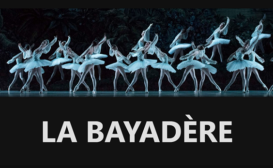

## Description

Interface utilisateur (UI) d'un site pour un ballet de danse classique, codé avec React. Utilisation de la librairie *framer-motion* afin de réaliser des animations au scroll de la page: parralax, opacité...  

Le site est en ligne à l'adresse : [https://labayadere.onrender.com](https://labayadere.onrender.com)

**Tags**: *React, framer-motion, parralax*

  

## Installation

### `npm install`

Afin d'installer toutes les librairies

### `npm run dev`

Pou lancer le serveur
